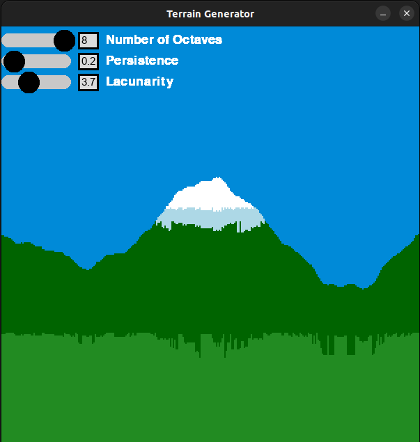

# Maze Generation and Pathfinding Simulator

#### Requirements:

- Python3
- Pygame
- Noise

#### How does it work?

- I used [Perlin Noise](https://en.wikipedia.org/wiki/Perlin_noise) to generate a series of numbers between 0 & 1 given a random seed. I iterated through this list of numbers and scaled them so that each number corresponded to a y value in a grid. This created the overall shape of the terrain. For adding color I used the same idea along with some scaling values and ranges in which each color should go.
- If you want to learn more this is the video I used to learn how to use Perlin Noise: [How does procedural generation work? | Bitwise](https://www.youtube.com/watch?v=-POwgollFeY&t=719s)

#### Use:

- Run generator.py
- Hit space to generate a new seed
- Use the sliders to fine tune the terrain
  - `octaves`: The number of levels of detail
  - `persistence`: Controls the amplitude of each octave
  - `lacunarity`: Controls the frequency of each octave

